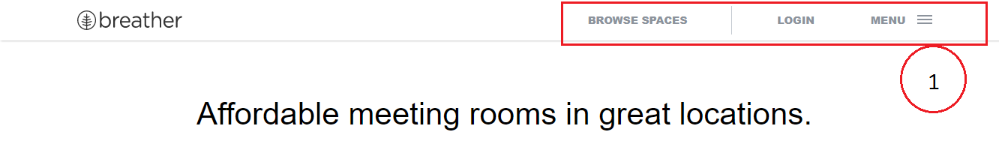
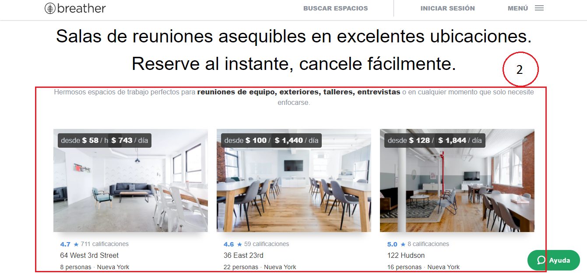
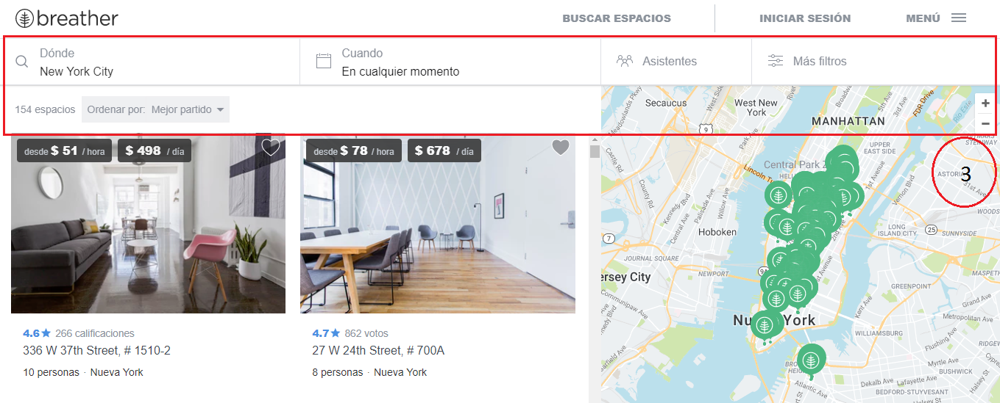
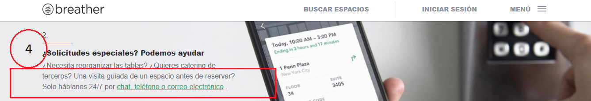
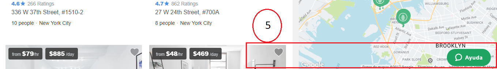
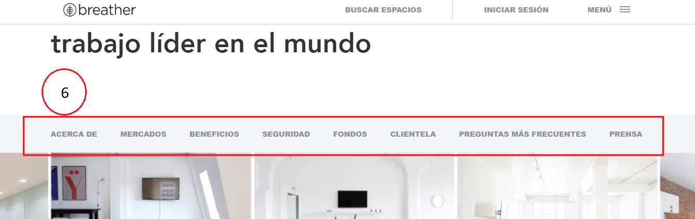

# **ELEMENTOS DE NAVEGACIÓN**
En este trabajo se enumera los elementos de navegación de las siguientes páginas:

## **BREATHER**

| 1.Navegación Global: Ya que me permite navegar por todo el sitio web.  |   4.Navegación en Linea: Me da un link de referencia en ese articulo.|
|:-------------|:-------------|
| 2.Navegación Contextual: Ya que me da recomendaciones acorde a el contexto de la navegacion. | 5. Elementos Desconocidos(lo concidero por que es un elemento recurrente y permite que el usuario obtenga ayuda). |
| 3.Navegación Filtrada: Me muestra opciones para filtrar mi busqueda. | 6. Navegacion Local: Me permite ingresar a opciones de la misma vista.|

  

  

  

  

  
